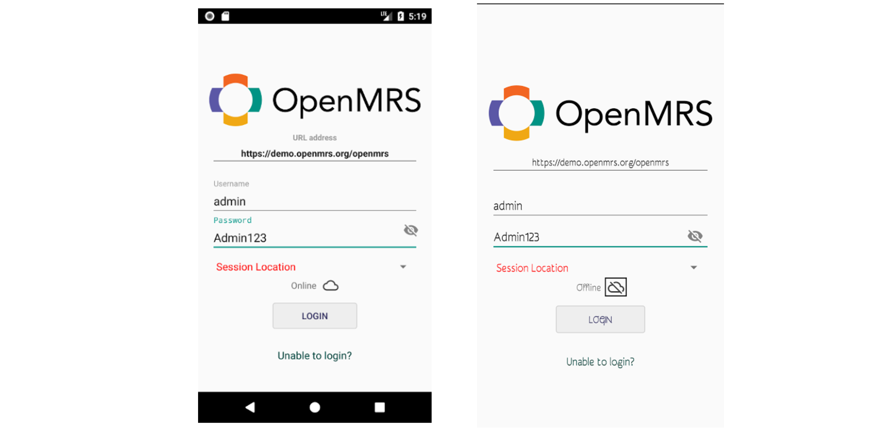
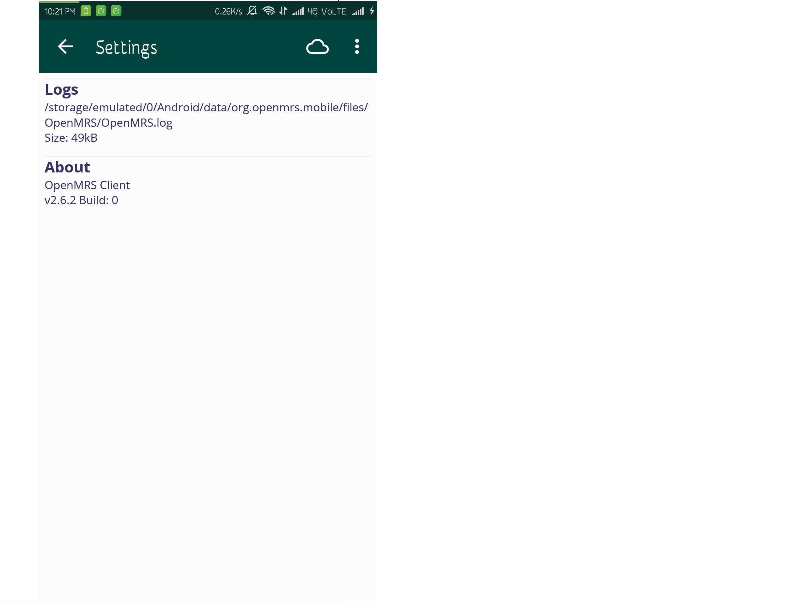

## Features
   
* ### Login
   1. Enter the server URL as  https://demo.openmrs.org/openmrs
     

   2. Now enter the username as admin and password as Admin123 .
   
   3. Select the Session location and also choose the Online/Offline option.
   
   4. Now click on Login. Now you will be redirected to the home page.

   ---

   

   Now, when heading to **Active Visits** and selecting the example patient, you will hopefully see that a *Vitals* form and a *Visit Note* form are successfully recorded during the patient's visit.

   > To learn more about the OpenMRS information model, take a look at this [guide for developers](http://guide.openmrs.org/en/Getting%20Started/openmrs-information-model.html).

* ### Entering Data

   1. Filling Up Forms

   2. Adding New Forms
       <!--Explain how to add forms on the server and basic form structure-->

   3. Form Examples
         
* ### Settings
The settings of the OpenMRS Android Client shows the path to access the log file. **A log file** records the events occurring in a software or an operating system. Logging is the process of keeping a log. All the messages are written to a single log file. Logging helps to understand what exactly a code is doing. It provides data about a code. This feature helps to fix errors and improve app operation. It helps greatly in debugging the software.

